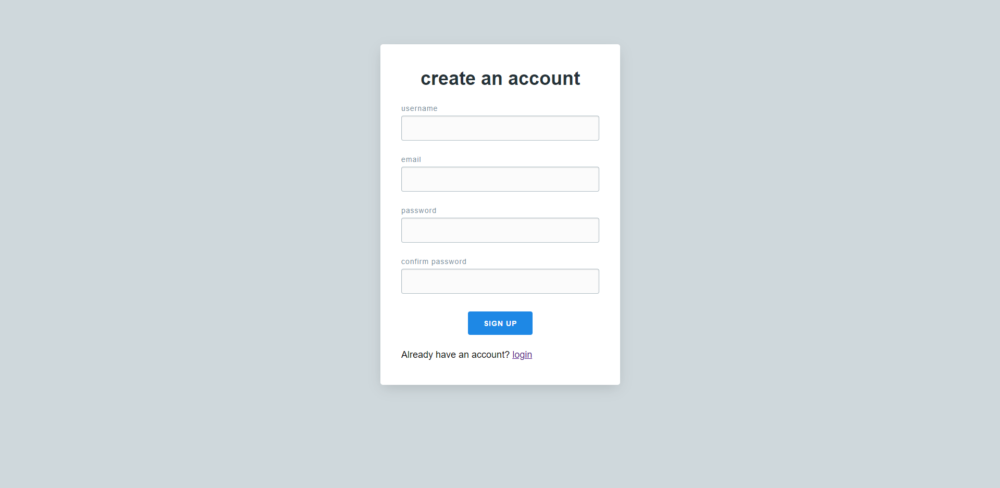
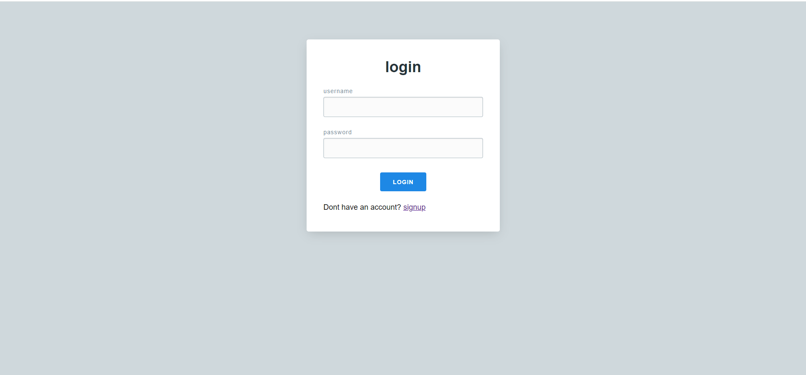
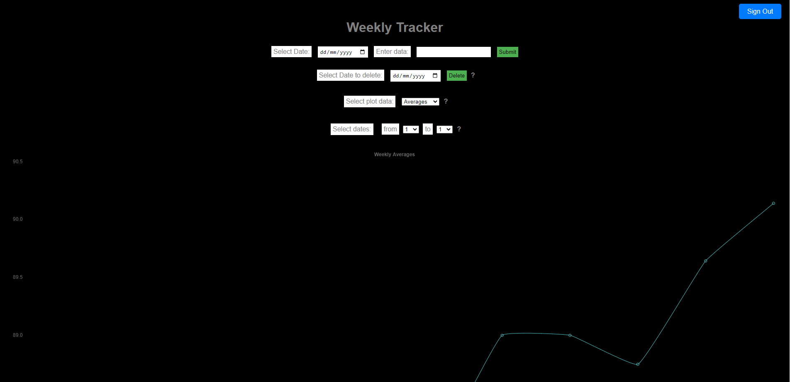
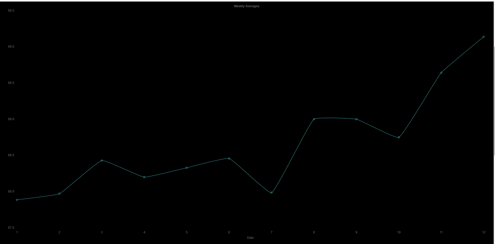

tracking my daily body weights and plotting the averages per week, using flask

How different pages look:

the numbers on x axis are weeks and the on the y axis is the average body weight per week (7 days)
below the graph the value of each week and the dates assosiate with them is also displayed